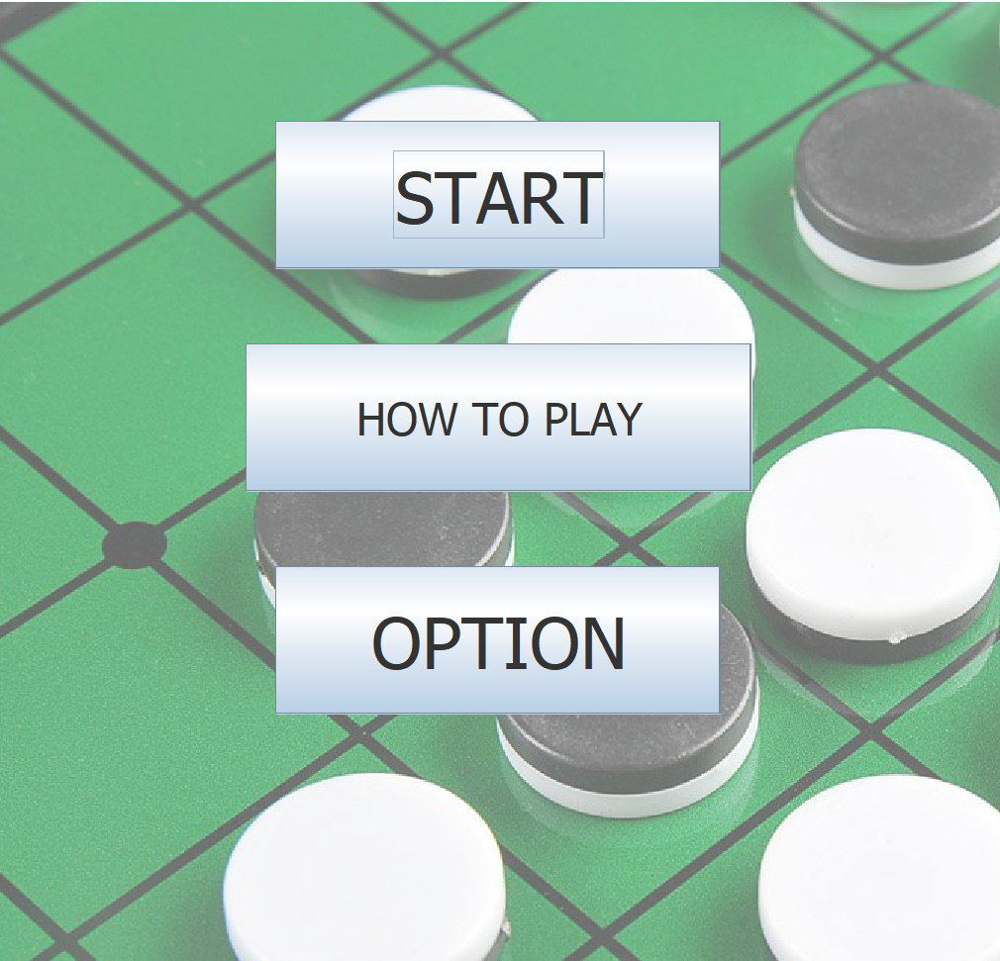

# Java Othello Game(PvP) (Beta)

**Java Othello Game** (Java Othello Game) is an othello game
that can play with 2 players. I created a two-player othello game, with count pices and a pass system as a part of a Object-oriented programming at University. Our objective was to develop and test a bug-free standalone game in Java, complete with a GUI and game logic components.

I developed this game by eclipse 2019(https://www.eclipse.org/) that is one of IDE(Integrated Development Environment). The source code is in this repository.

**Technology**
This game is using core Java , Java Swing GUI libraries and javax libraries. It uses custom drawing for game components and self-programmed logic for othello game. The code is not complicated and object oriented, which was a score indicator for the assignment.

**Running**
It have .jar file in this repository is in the folder.  You can run the executable .jar file, named othello.jar to play.